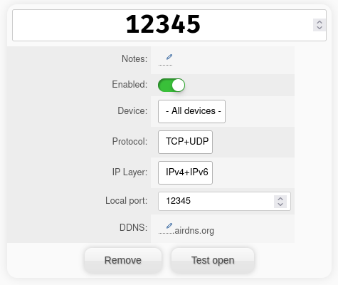

In order to open a port through a VPN you need to open a port with your VPN-provider.

> **Note:** Not all VPN-providers support this feature! Notably, Mullvad does not anymore!

> **Note:** The port present in the
>           [nixarr.vpn.wgConf](https://nixarr.com/options.html#nixarr.vpn.wgconf),
>           should not be used for any options!

## AirVPN

Go to the [ports page](https://airvpn.org/ports/) at AirVPN's website open
a port. After opening it should look like this:



Then you can set that port for a service, for example

```nix {.numberLines}
  nixarr.transmission = {
    enable = true;
    vpn.enable = true;
    peerPort = 12345;
  };
```

## Debugging Ports

> **Note:** See [this GH issue](https://github.com/rasmus-kirk/nixarr/issues/27)
>           first, since it's a common problem

You can debug an open port using the
[nixarr.vpn.vpnTestService](https://nixarr.com/options.html#nixarr.vpn.vpntestservice.enable):

```nix {.numberLines}
  nixarr.vpn.vpnTestService = {
    enable = true;
    port = 12345;
  };
```

The service should be started automatically, to rerun it:

```sh
  systemctl restart vpn-test-service
```

If the DNS and IP checks out, it will
open a `netcat` instance on the port specified in
[nixarr.vpn.vpnTestService.port](https://nixarr.com/options.html#nixarr.vpn.vpntestservice.port).
You can then run the following from any computer:

```sh
  nc <public VPN ip> <specified port>
```

Where the "`public VPN ip`" is the public IP of your VPN address, i.e. the
one shown in the `vpn-test-service` logs as your ip:

```sh
  journalctl -xeu vpn-test-service
```

Which should look something like:

```default
  ; <<>> DiG 9.18.27 <<>> google.com
  
  ...
  
  Getting IP:
  {
    "ip": "12.34.56.78",
    "hostname": "---.--.---.--.-------.----",
    "city": "---------",
    "region": "---------",
    "country": "--",
    "loc": "00.0000,00.0000",
    "org": "----------------------",
    "postal": "------",
    "timezone": "----------------",
    "readme": "-----------------------------"
  }
  DNS leak test:
  Your IP:
  12.34.56.78 [------, ----------------------]
  You use 3 DNS servers:
  ---.---.---.-- [------, -----------------------]
  ---.---.---.- [------, -----------------------]
  ---.---.---.- [------, -----------------------]
  Conclusion:
  DNS may be leaking.
```

> **Note:** It says that my DNS may be leaking, but all my DNS-servers are
> from country B, while I'm located in country A. Take the conclusion with a
> grain of salt

Here, your "`public VPN ip`" would be "`12.34.56.78`".
